<div align="center">

# 🦿 Pathological Gait & Activity Recognition

### Deep Learning Framework for Out-of-Clinic Gait Anomaly Detection

[](https://python.org)
[](https://pytorch.org)
[](https://developer.nvidia.com/cuda-toolkit)
[](https://arxiv.org/abs/2310.06625)
[](https://github.com/romanchereshnev/HuGaDB)

<br/>

> **"Monitoring walking patterns to detect anomalies like a post-stroke hemiplegic limp or general mobility issues — outside of a clinical setting."**

</div>

---

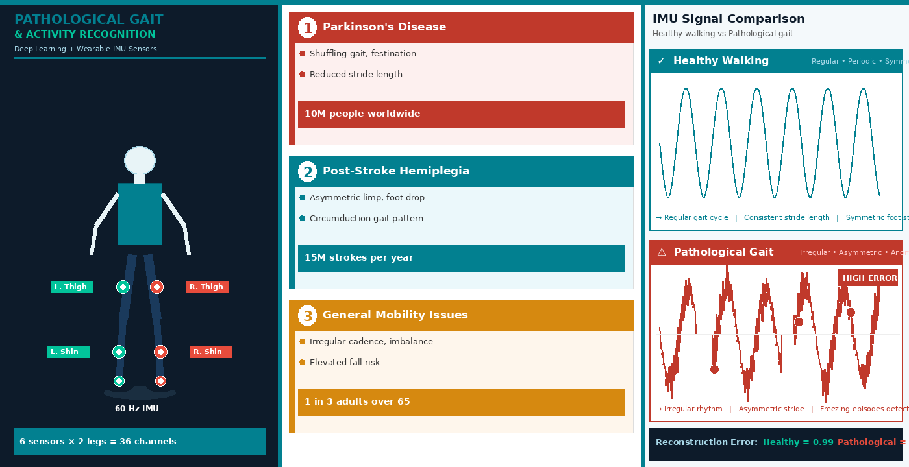

## 🎯 The Problem

Gait disorders affect hundreds of millions of people worldwide. Conditions like **Parkinson's disease**, **post-stroke hemiplegia**, and **general mobility impairments** all manifest as abnormal walking patterns.

Traditional clinical gait assessment is:

| Issue | Impact |
|---|---|
| ❌ Confined to hospitals | Only assessed during rare clinic visits |
| ❌ Expensive | Specialist labs cost thousands per session |
| ❌ Not continuous | Gait changes between visits go undetected |

### Conditions We Target

| Condition | Gait Signature | Global Scale |
|---|---|---|
| 🧠 **Parkinson's Disease** | Shuffling, reduced stride, festination | 10 million people worldwide |
| 🫀 **Post-Stroke Hemiplegia** | Asymmetric limp, foot drop, circumduction | 15 million strokes per year |
| 🦽 **General Mobility Issues** | Irregular cadence, balance instability | 1 in 3 adults over 65 |

**Our solution:** Wearable IMU sensors + Deep Learning = continuous, out-of-clinic gait monitoring.

---

## 🏗️ What We Built

A two-component deep learning framework:

```
Wearable IMU Sensors (60 Hz, 6 sensors on both legs, 36 channels)
                         │
                         ▼
        ┌────────────────────────────────┐
        │         Component 1            │
        │      Activity Recognition      │
        │  1D-CNN │ BiLSTM │ iTransformer│
        │  → Classifies 10 gait activities│
        └────────────────────────────────┘
                         │
                         ▼
        ┌────────────────────────────────┐
        │         Component 2            │
        │       Anomaly Detection        │
        │   Convolutional Autoencoder    │
        │   → Flags pathological gait    │
        └────────────────────────────────┘
```

---

## 📊 Dataset — HuGaDB v2

**Source:** [github.com/romanchereshnev/HuGaDB](https://github.com/romanchereshnev/HuGaDB)

| Property | Value |
|---|---|
| Participants | 18 healthy adults |
| Sensors | 6 wearable IMUs (thigh + shin + foot × both legs) |
| Channels | 36 (3-axis accel + 3-axis gyro per sensor) |
| Total samples | 1,137,986 |
| Sampling rate | ~60 Hz |
| Activity classes | 10 |
| Files | 364 continuous recordings |

### Class Distribution

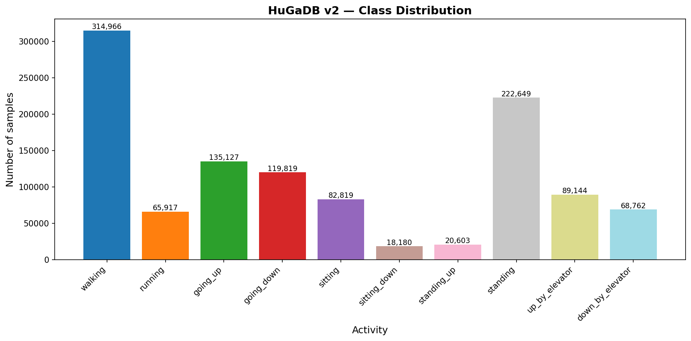

*Walking (27.7%) and standing (19.6%) dominate. Class imbalance handled with balanced class weights.*

### Raw IMU Signals During Walking

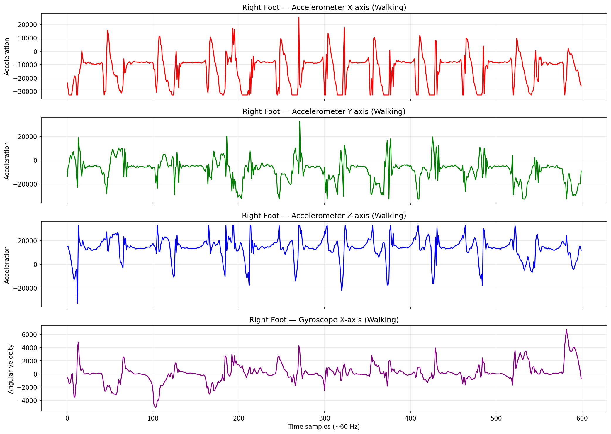

*Clear periodic oscillations in foot accelerometer correspond to each footstep — the foundation for our models to learn gait patterns.*

### Activity Signal Comparison

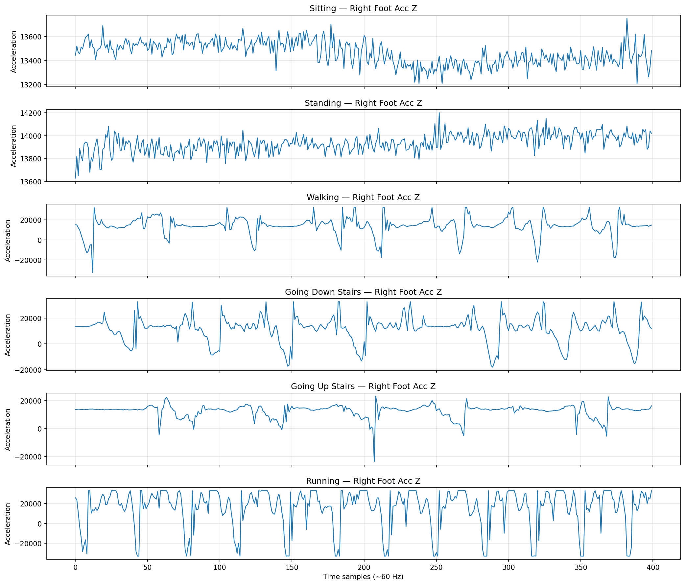

*Each activity has a visually distinct sensor signature — justifying deep learning classification.*

---

## 🤖 Model Architectures

### Baseline 1 — 1D-CNN

```
Input [Batch × 36 channels × 128 timesteps]
  ├─ Conv1D(36→64,  k=7) + BatchNorm + ReLU + Dropout(0.2)
  ├─ Conv1D(64→128, k=5) + BatchNorm + ReLU + Dropout(0.2)
  ├─ Conv1D(128→256,k=3) + BatchNorm + ReLU + Dropout(0.2)
  ├─ Global Average Pooling
  ├─ Linear(256→128) + ReLU + Dropout(0.3)
  └─ Linear(128→10 classes)   [190,922 parameters]
```

### Baseline 2 — BiLSTM

```
Input [Batch × 128 timesteps × 36 features]
  ├─ BiLSTM(input=36, hidden=128, layers=2, dropout=0.3)
  ├─ Take last timestep → [Batch × 256]
  ├─ Linear(256→128) + ReLU + Dropout(0.3)
  └─ Linear(128→10 classes)
```

### Main Model — iTransformer (ICLR 2024 Spotlight) ⭐

```
Input [Batch × 128 timesteps × 36 sensors]
  │
  │  KEY INNOVATION: Each SENSOR = 1 token (not each timestep)
  │  Self-attention captures inter-sensor correlations
  │  e.g. right foot + left shin sync during walking
  │
  ├─ Sensor Embedding: 128-step series → 64-dim vector
  ├─ Learnable Sensor Positional Encoding
  ├─ × 3 iTransformer Blocks:
  │    ├─ Multi-Head Self-Attention (4 heads) — across sensors
  │    ├─ Feed-Forward Network (d_ff=128, GELU)
  │    └─ LayerNorm + Residual
  ├─ Flatten → Linear(2304→256) → Linear(256→128) → Linear(128→10)
  └─ Output: 10 activity class probabilities
```

### Anomaly Detection — Convolutional Autoencoder

```
Trained ONLY on healthy walking windows
Input [Batch × 36 × 128]
  ENCODER: Conv1D×3 + MaxPool → compressed bottleneck [16 × 16]
  DECODER: Upsample×3 + Conv1D → reconstruction [36 × 128]
  ANOMALY SCORE = MSE(input, reconstruction)
  High error → gait deviates from healthy → potential pathology
```

---

## ⚙️ Implementation Details

| Hyperparameter | Value |
|---|---|
| Window size | 128 samples (~2.1 sec at 60 Hz) |
| Window overlap | 50% (step = 64) |
| Normalization | StandardScaler — fit on train only |
| Train participants | 1, 2, 5, 6, 8, 10, 11, 13, 14, 15 |
| Val participants | 16, 17, 18 |
| Test participants | 3, 4, 7, 9, 12 |
| Batch size | 64 |
| Epochs (classifiers) | 40 |
| Epochs (autoencoder) | 30 |
| Optimizer (CNN/BiLSTM) | Adam (lr = 1e-3) |
| Optimizer (iTransformer) | AdamW (lr = 1e-3, wd = 1e-4) |
| Scheduler | Warmup (5 ep) + CosineAnnealingLR |
| Loss (classifiers) | CrossEntropyLoss + balanced weights |
| Loss (autoencoder) | MSE |
| Framework | PyTorch 2.10.0 + CUDA |
| Hardware | NVIDIA Tesla T4 (Google Colab) |

> ⚠️ **Data split is subject-level** — no participant appears in both train and test sets. Random splitting would cause data leakage.

---

## 📈 Results

### Model Comparison

| Model | Accuracy | Precision | Recall | F1 Score |
|---|---|---|---|---|
| 1D-CNN (Baseline) | 80.46% | 0.7889 | 0.8046 | 0.7596 |
| BiLSTM (Baseline) | 79.36% | 0.7868 | 0.7936 | 0.7866 |
| **iTransformer ICLR 2024** | **80.29%** | **0.7818** | **0.8029** | **0.7753 ★** |

> F1 is the primary metric due to class imbalance. **iTransformer achieves the best weighted F1**, meaning it handles minority classes better than both baselines.

### Training Curves

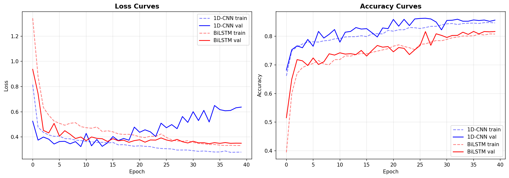

*1D-CNN (blue) and BiLSTM (red) — smooth convergence over 40 epochs.*

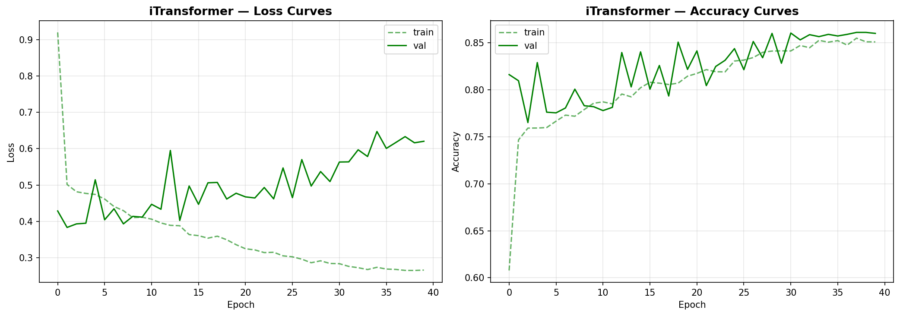

*iTransformer with warmup scheduling — accuracy still rising at epoch 40.*

### Confusion Matrices

<table>
<tr>
<td align="center">
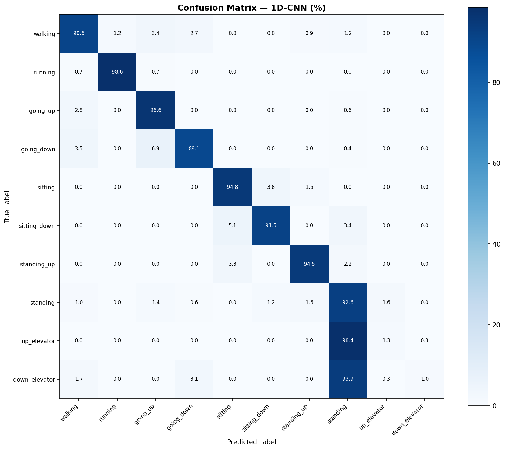
<b>1D-CNN</b>
</td>
<td align="center">
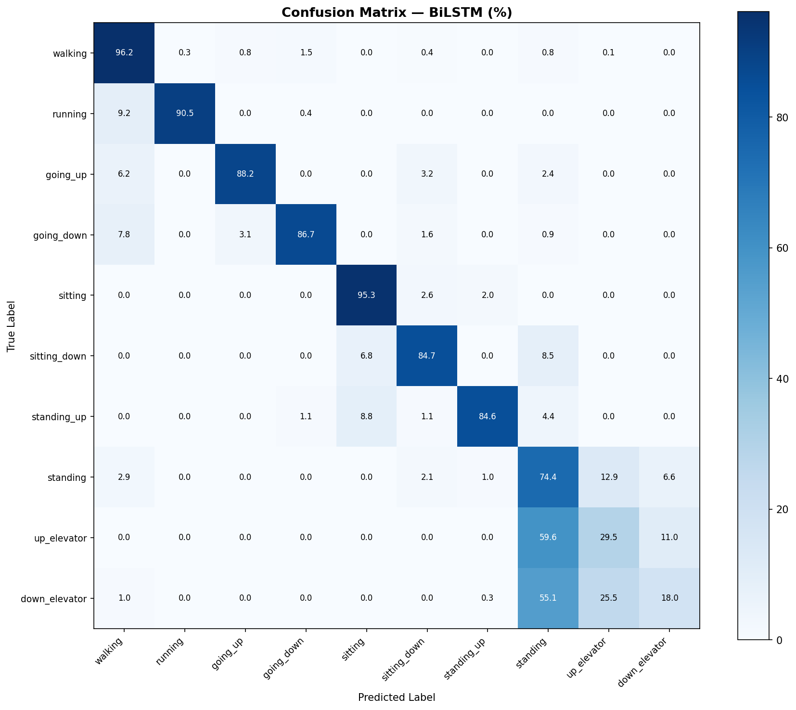
<b>BiLSTM</b>
</td>
<td align="center">
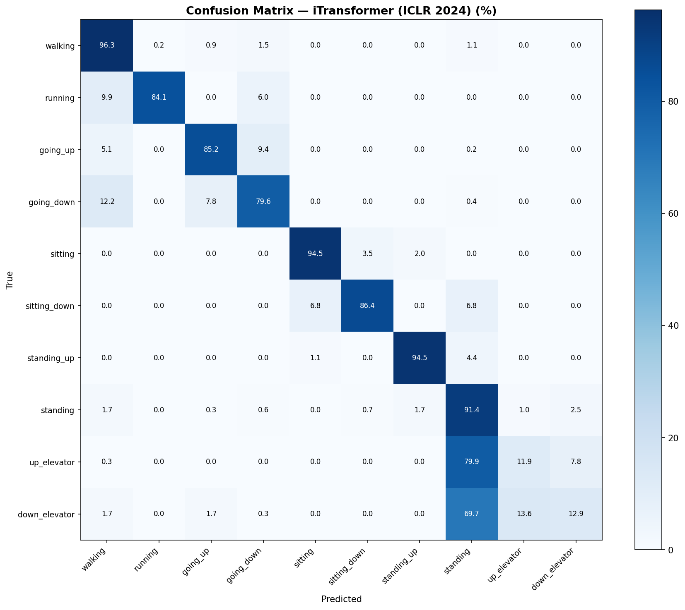
<b>iTransformer ★</b>
</td>
</tr>
</table>

**Highlights:**
- 🏃 Running: **98.6%** per-class accuracy
- 🪜 Going up stairs: **96.6%**
- 🪑 Sitting: **94.8%**
- ⚠️ Main confusion: going up vs going down stairs

---

## 🔍 Anomaly Detection Results

### Reconstruction Error by Activity

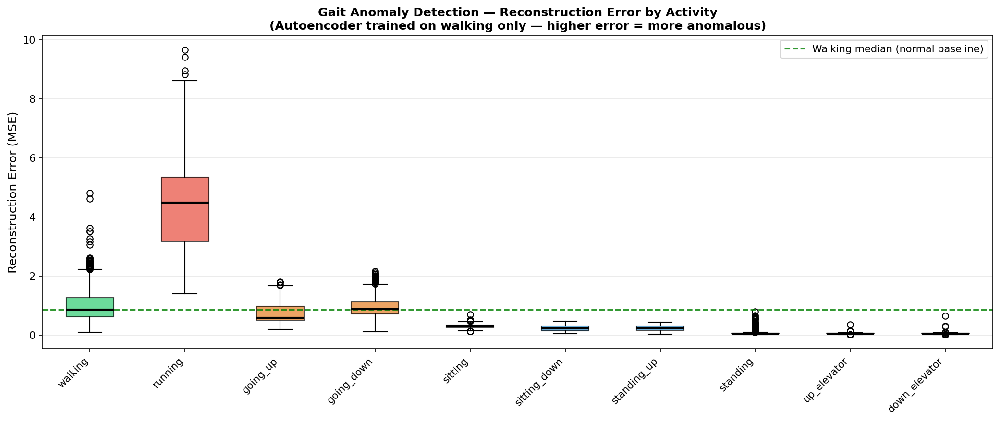

| Activity | Mean MSE | vs Walking |
|---|---|---|
| **Walking (healthy baseline)** | **0.9876** | **1.0×** |
| Running | 4.4807 | **4.5× higher ↑** |
| Going up stairs | 0.7226 | 0.73× |
| Going down stairs | 0.9617 | 0.97× |
| Sitting | 0.3015 | 0.31× |
| Standing | 0.0699 | 0.07× |

### Autoencoder Training Loss

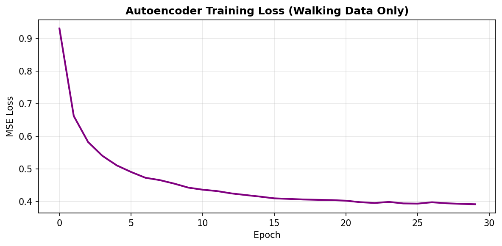

> **Clinical implication:** A stroke patient with hemiplegic gait produces irregular, asymmetric walking signals. The autoencoder — trained only on healthy walking — would assign **4x+ higher reconstruction error** to such signals, enabling automated screening without labeled pathological data.

---

## 📁 Repository Structure

```
Pathological-Gait-Recognition-DL/
│
├── 📓 notebooks/
│   ├── 01_data_exploration.ipynb
│   ├── 02_preprocessing.ipynb
│   ├── 03_baselines.ipynb
│   ├── 04_itransformer.ipynb
│   └── 05_anomaly_detection.ipynb
│
├── 📊 results/
│   ├── class_distribution.png
│   ├── raw_signals_walking.png
│   ├── activity_comparison.png
│   ├── loss_curves_baselines.png
│   ├── loss_curves_itransformer.png
│   ├── confusion_matrix_cnn.png
│   ├── confusion_matrix_bilstm.png
│   ├── confusion_matrix_itransformer.png
│   ├── anomaly_detection_boxplot.png
│   └── autoencoder_loss.png
│
└── 📋 README.md
```

---

## 🚀 How to Run

### 1. Download Dataset
```
HuGaDB v2: https://drive.google.com/open?id=15zLaP5V3ltR6qro98u492eqFBSeSO-0m
```
Upload to Google Drive at `MyDrive/DL_Project_Gait/data/HuGaDB v2.zip`

### 2. Run Notebooks in Order
```
01_data_exploration   →  Understand the dataset
02_preprocessing      →  Sliding window + normalization
03_baselines          →  Train 1D-CNN and BiLSTM
04_itransformer       →  Train iTransformer (ICLR 2024)
05_anomaly_detection  →  Train autoencoder + anomaly scoring
```

### 3. Requirements
```
torch>=2.0.0
numpy
pandas
scikit-learn
matplotlib
seaborn
tqdm
```

---

## ⚠️ Limitations & Future Work

**Limitations:**
- HuGaDB contains only healthy subjects — no direct pathological validation
- Small training set (10,274 windows) limits model capacity

**Future work:**
- Validate on PhysioNet GaitPD (real Parkinson's patients)
- Validate on Daphnet Freezing of Gait dataset
- Real-time deployment on edge devices / smartphones
- Patient-specific anomaly thresholds

---

## 📚 References

| Ref | Paper |
|---|---|
| [1] | Chereshnev & Kertész-Farkas (2018) — HuGaDB |
| [2] | Liu et al., ICLR 2024 — iTransformer |
| [3] | Vaswani et al., NeurIPS 2017 — Attention is All You Need |
| [4] | Ordóñez & Roggen, Sensors 2016 — DeepConvLSTM |
| [5] | Goldberger et al. (2000) — PhysioNet |

---

<div align="center">

*Built with PyTorch 2.10 + CUDA on NVIDIA Tesla T4 GPU*

</div>
